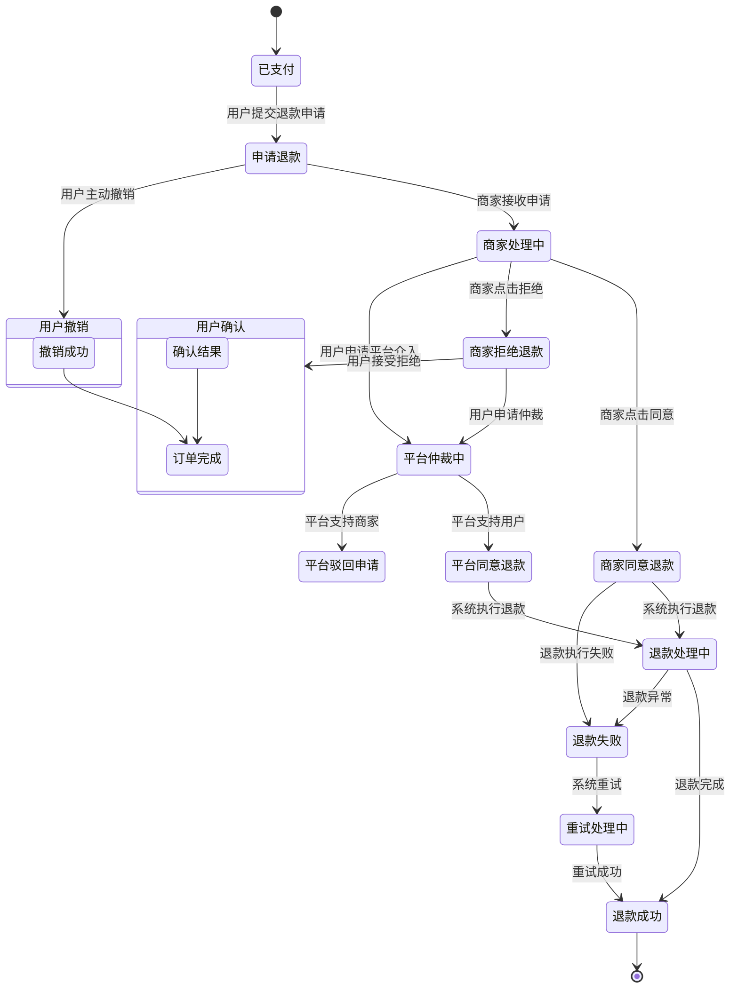
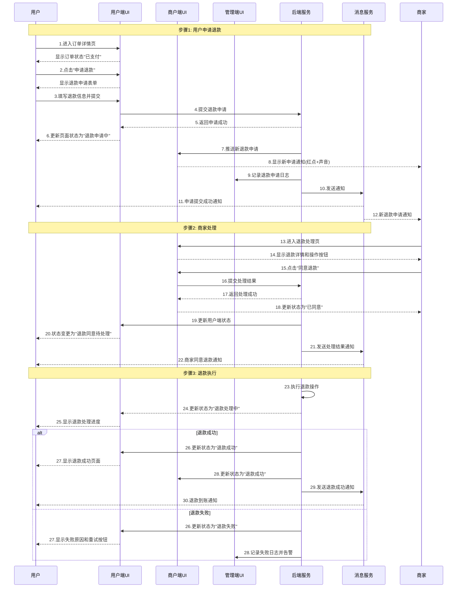

# 企业级退款流程UI状态管理完整设计

## 1. 退款状态机与UI联动设计

### 退款状态流转图


## 2. 各端UI状态变更提示词模板

### 2.1 用户端UI状态管理

**指令模板1：用户订单详情页状态显示**

【任务类型】用户订单详情页状态UI设计
【页面位置】pages/order/detail/index
【状态映射】：
| 退款状态     | 状态标签       | 标签颜色 | 主按钮       | 副按钮   | 说明文案                          |
| ------------ | -------------- | -------- | ------------ | -------- | --------------------------------- |
| 申请退款     | 退款申请中     | #FF9500  | 撤销申请     | 联系客服 | 商家将在24小时内处理您的申请      |
| 商家处理中   | 商家处理中     | #FF9500  | 催促处理     | 联系客服 | 商家正在处理您的退款申请          |
| 商家同意退款 | 退款同意待处理 | #34C759  | 查看进度     | 联系商家 | 商家已同意退款，正在处理中        |
| 退款处理中   | 退款处理中     | #34C759  | 查看进度     | -        | 退款正在处理，预计1-3个工作日到账 |
| 退款成功     | 退款成功       | #34C759  | 查看详情     | 重新购买 | 退款已成功，¥{amount}已退回       |
| 商家拒绝退款 | 退款被拒绝     | #FF3B30  | 申请平台介入 | 联系商家 | 商家拒绝了您的退款申请            |
| 平台仲裁中   | 平台处理中     | #FF9500  | 查看进度     | 补充凭证 | 平台客服正在处理您的争议          |
| 退款失败     | 退款失败       | #FF3B30  | 重新申请     | 联系客服 | 退款失败，请重新尝试或联系客服    |
| 用户撤销     | 已撤销         | #8E8E93  | 重新申请     | 查看记录 | 您已撤销退款申请                  |

【UI组件要求】：
1. 状态标签：在页面顶部显著位置展示
2. 时间线组件：展示退款处理进度时间线
3. 操作按钮：根据状态动态显示对应按钮
4. 金额显示：清晰显示退款金额
5. 凭证展示：支持图片、文字凭证展示

指令模板2：用户订单列表页状态显示

【任务类型】用户订单列表页状态UI设计
【页面位置】pages/order/list/index
【列表项设计】：
正常订单项布局：
┌─────────────────────────┐
│ 订单号：202401010001    │
│ 门店：星巴克(中关村店)  │
│ 商品：拿铁×2           │
│ 金额：¥58.00           │
│ 时间：今天 14:30       │
│ 状态：[退款中]         │ ← 状态标签
└─────────────────────────┘

【状态标签设计】：
1. 申请退款：橙色标签"退款申请中"
2. 商家处理中：橙色标签"处理中"
3. 商家同意退款：绿色标签"退款中"
4. 退款成功：灰色标签"已退款"
5. 商家拒绝退款：红色标签"被拒绝"
6. 平台仲裁中：橙色标签"仲裁中"

【交互要求】：
1. 点击订单项进入对应状态的详情页
2. 下拉刷新更新订单状态
3. 筛选功能：支持按退款状态筛选

### 2.2 商户端UI状态管理

**指令模板3：商户订单管理列表页**

【任务类型】商户订单列表页状态UI设计
【页面位置】merchant/pages/order/list/index
【列表布局】：
待处理退款订单（置顶显示）：
┌─────────────────────────────────┐
│ 🔴 有1个退款申请待处理          │ ← 置顶提醒条
├─────────────────────────────────┤
│ 订单：202401010001              │
│ 用户：张**                      │
│ 商品：拿铁×2                   │
│ 申请时间：2分钟前               │
│ 退款原因：点错了                │
│ [立即处理] [查看详情]           │ ← 操作按钮
└─────────────────────────────────┘

已处理退款订单：
┌─────────────────────────────────┐
│ 订单：202401010002              │
│ 用户：李**                      │
│ 状态：✅ 已同意退款            │
│ 处理时间：今天 10:30           │
│ 操作：[查看详情]                │
└─────────────────────────────────┘

【状态显示规则】：
1. 新申请：红色角标+高亮显示
2. 处理中：显示剩余处理时间倒计时
3. 已处理：灰色显示，操作受限
4. 平台介入：特殊标识提醒

【筛选与排序】：
1. 状态筛选：全部/待处理/已处理/平台介入
2. 时间排序：按申请时间倒序
3. 紧急程度：超时订单特殊标记

指令模板4：商户退款处理详情页

【任务类型】商户退款处理详情页UI设计
【页面位置】merchant/pages/refund/detail/index
【页面布局】：

头部状态栏：
┌─────────────────────────┐
│ 退款申请详情            │
│ 状态：[待处理]          │
│ 剩余时间：23:59:59      │ ← 处理倒计时
└─────────────────────────┘

用户申请信息：
├ 用户信息：张**(138****0000)
├ 订单信息：202401010001
├ 申请时间：今天 14:30:20
├ 退款金额：¥58.00
└ 退款原因：点错了商品

用户凭证（如果有）：
├ 图片凭证：[查看图片]
└ 文字说明：希望退款

订单商品信息：
┌─────────────────────────┐
│ 商品        数量   单价  │
│ 拿铁          2    ¥29  │
│ 抹茶蛋糕      1    ¥25  │
└─────────────────────────┘

商家操作区：
┌─────────────────────────┐
│ 处理意见：______________ │ ← 必填，用于拒绝时说明
│                                 │
│  ○ 同意退款（全额¥58.00）       │
│  ○ 同意退款（部分¥__.__）       │
│  ● 拒绝退款                     │
│                                 │
│  [取消]      [确认处理]         │
└─────────────────────────┘

【状态相关操作】：
1. 待处理：显示完整操作表单
2. 已同意：显示"已同意退款"和退款进度
3. 已拒绝：显示拒绝原因和用户反馈入口
4. 平台介入：显示仲裁信息和补充凭证入口

### 2.3 平台管理端UI状态管理

**指令模板5：平台退款仲裁管理页**

【任务类型】平台退款仲裁管理页UI设计
【页面位置】admin/pages/refund/arbitration/index
【页面布局】：

筛选与统计栏：
┌─────────────────────────────────┐
│ 退款仲裁管理                    │
│ 今日待处理：12   本周仲裁率：5%  │
├─────────────────────────────────┤
│ 搜索订单/用户                   │
│ [全部] [待仲裁] [处理中] [已完结]│
└─────────────────────────────────┘

仲裁列表：
┌─────────────────────────────────┐
│ 仲裁ID：ARB202401010001         │
│ 状态：🔴 紧急（即将超时）        │
│ 用户：张** vs 商家：星巴克       │
│ 争议焦点：商品质量问题          │
│ 申请时间：2小时前               │
│ 剩余：1小时                     │
│ [立即处理]                      │
└─────────────────────────────────┘

┌─────────────────────────────────┐
│ 仲裁ID：ARB202401010002         │
│ 状态：🟡 处理中                 │
│ 用户：李** vs 商家：麦当劳      │
│ 仲裁员：客服001                 │
│ 开始时间：30分钟前              │
│ [查看详情]                      │
└─────────────────────────────────┘

【状态颜色编码】：
1. 紧急（红色）：剩余时间<2小时
2. 处理中（黄色）：已分配仲裁员
3. 待处理（蓝色）：新申请
4. 已完结（灰色）：处理完成

【操作权限】：
1. 客服：查看、处理分配到的仲裁
2. 主管：查看全部、分配、介入处理
3. 管理员：所有权限+数据导出

## 3. 退款流程完整UI变更时序

### 完整退款流程UI状态变更时序


# 企业级退款流程UI状态管理完整设计

## 1. 退款状态机与UI联动设计

### 退款状态流转图

mermaid




## 2. 各端UI状态变更提示词模板

### 2.1 用户端UI状态管理

**指令模板1：用户订单详情页状态显示**


复制

```
【任务类型】用户订单详情页状态UI设计
【页面位置】pages/order/detail/index
【状态映射】：
| 退款状态 | 状态标签 | 标签颜色 | 主按钮 | 副按钮 | 说明文案 |
|---------|---------|---------|--------|--------|---------|
| 申请退款 | 退款申请中 | #FF9500 | 撤销申请 | 联系客服 | 商家将在24小时内处理您的申请 |
| 商家处理中 | 商家处理中 | #FF9500 | 催促处理 | 联系客服 | 商家正在处理您的退款申请 |
| 商家同意退款 | 退款同意待处理 | #34C759 | 查看进度 | 联系商家 | 商家已同意退款，正在处理中 |
| 退款处理中 | 退款处理中 | #34C759 | 查看进度 | - | 退款正在处理，预计1-3个工作日到账 |
| 退款成功 | 退款成功 | #34C759 | 查看详情 | 重新购买 | 退款已成功，¥{amount}已退回 |
| 商家拒绝退款 | 退款被拒绝 | #FF3B30 | 申请平台介入 | 联系商家 | 商家拒绝了您的退款申请 |
| 平台仲裁中 | 平台处理中 | #FF9500 | 查看进度 | 补充凭证 | 平台客服正在处理您的争议 |
| 退款失败 | 退款失败 | #FF3B30 | 重新申请 | 联系客服 | 退款失败，请重新尝试或联系客服 |
| 用户撤销 | 已撤销 | #8E8E93 | 重新申请 | 查看记录 | 您已撤销退款申请 |

【UI组件要求】：
1. 状态标签：在页面顶部显著位置展示
2. 时间线组件：展示退款处理进度时间线
3. 操作按钮：根据状态动态显示对应按钮
4. 金额显示：清晰显示退款金额
5. 凭证展示：支持图片、文字凭证展示
```

**指令模板2：用户订单列表页状态显示**


复制

```
【任务类型】用户订单列表页状态UI设计
【页面位置】pages/order/list/index
【列表项设计】：
正常订单项布局：
┌─────────────────────────┐
│ 订单号：202401010001    │
│ 门店：星巴克(中关村店)  │
│ 商品：拿铁×2           │
│ 金额：¥58.00           │
│ 时间：今天 14:30       │
│ 状态：[退款中]         │ ← 状态标签
└─────────────────────────┘

【状态标签设计】：
1. 申请退款：橙色标签"退款申请中"
2. 商家处理中：橙色标签"处理中"
3. 商家同意退款：绿色标签"退款中"
4. 退款成功：灰色标签"已退款"
5. 商家拒绝退款：红色标签"被拒绝"
6. 平台仲裁中：橙色标签"仲裁中"

【交互要求】：
1. 点击订单项进入对应状态的详情页
2. 下拉刷新更新订单状态
3. 筛选功能：支持按退款状态筛选
```

### 2.2 商户端UI状态管理

**指令模板3：商户订单管理列表页**


复制

```
【任务类型】商户订单列表页状态UI设计
【页面位置】merchant/pages/order/list/index
【列表布局】：
待处理退款订单（置顶显示）：
┌─────────────────────────────────┐
│ 🔴 有1个退款申请待处理          │ ← 置顶提醒条
├─────────────────────────────────┤
│ 订单：202401010001              │
│ 用户：张**                      │
│ 商品：拿铁×2                   │
│ 申请时间：2分钟前               │
│ 退款原因：点错了                │
│ [立即处理] [查看详情]           │ ← 操作按钮
└─────────────────────────────────┘

已处理退款订单：
┌─────────────────────────────────┐
│ 订单：202401010002              │
│ 用户：李**                      │
│ 状态：✅ 已同意退款            │
│ 处理时间：今天 10:30           │
│ 操作：[查看详情]                │
└─────────────────────────────────┘

【状态显示规则】：
1. 新申请：红色角标+高亮显示
2. 处理中：显示剩余处理时间倒计时
3. 已处理：灰色显示，操作受限
4. 平台介入：特殊标识提醒

【筛选与排序】：
1. 状态筛选：全部/待处理/已处理/平台介入
2. 时间排序：按申请时间倒序
3. 紧急程度：超时订单特殊标记
```

**指令模板4：商户退款处理详情页**


复制

```
【任务类型】商户退款处理详情页UI设计
【页面位置】merchant/pages/refund/detail/index
【页面布局】：

头部状态栏：
┌─────────────────────────┐
│ 退款申请详情            │
│ 状态：[待处理]          │
│ 剩余时间：23:59:59      │ ← 处理倒计时
└─────────────────────────┘

用户申请信息：
├ 用户信息：张**(138****0000)
├ 订单信息：202401010001
├ 申请时间：今天 14:30:20
├ 退款金额：¥58.00
└ 退款原因：点错了商品

用户凭证（如果有）：
├ 图片凭证：[查看图片]
└ 文字说明：希望退款

订单商品信息：
┌─────────────────────────┐
│ 商品        数量   单价  │
│ 拿铁          2    ¥29  │
│ 抹茶蛋糕      1    ¥25  │
└─────────────────────────┘

商家操作区：
┌─────────────────────────┐
│ 处理意见：______________ │ ← 必填，用于拒绝时说明
│                                 │
│  ○ 同意退款（全额¥58.00）       │
│  ○ 同意退款（部分¥__.__）       │
│  ● 拒绝退款                     │
│                                 │
│  [取消]      [确认处理]         │
└─────────────────────────┘

【状态相关操作】：
1. 待处理：显示完整操作表单
2. 已同意：显示"已同意退款"和退款进度
3. 已拒绝：显示拒绝原因和用户反馈入口
4. 平台介入：显示仲裁信息和补充凭证入口
```

### 2.3 平台管理端UI状态管理

**指令模板5：平台退款仲裁管理页**


复制

```
【任务类型】平台退款仲裁管理页UI设计
【页面位置】admin/pages/refund/arbitration/index
【页面布局】：

筛选与统计栏：
┌─────────────────────────────────┐
│ 退款仲裁管理                    │
│ 今日待处理：12   本周仲裁率：5%  │
├─────────────────────────────────┤
│ 搜索订单/用户                   │
│ [全部] [待仲裁] [处理中] [已完结]│
└─────────────────────────────────┘

仲裁列表：
┌─────────────────────────────────┐
│ 仲裁ID：ARB202401010001         │
│ 状态：🔴 紧急（即将超时）        │
│ 用户：张** vs 商家：星巴克       │
│ 争议焦点：商品质量问题          │
│ 申请时间：2小时前               │
│ 剩余：1小时                     │
│ [立即处理]                      │
└─────────────────────────────────┘

┌─────────────────────────────────┐
│ 仲裁ID：ARB202401010002         │
│ 状态：🟡 处理中                 │
│ 用户：李** vs 商家：麦当劳      │
│ 仲裁员：客服001                 │
│ 开始时间：30分钟前              │
│ [查看详情]                      │
└─────────────────────────────────┘

【状态颜色编码】：
1. 紧急（红色）：剩余时间<2小时
2. 处理中（黄色）：已分配仲裁员
3. 待处理（蓝色）：新申请
4. 已完结（灰色）：处理完成

【操作权限】：
1. 客服：查看、处理分配到的仲裁
2. 主管：查看全部、分配、介入处理
3. 管理员：所有权限+数据导出
```

## 3. 退款流程完整UI变更时序

### 完整退款流程UI状态变更时序

mermaid




## 6. 与代码AI沟通的完整示例

### 完整退款UI状态管理沟通模板

【任务类型】退款流程全链路UI状态管理开发
【业务需求】实现用户申请退款后，用户端、商户端、管理端UI的实时状态同步与显示

【一、状态定义】
退款状态枚举：
1. APPLIED - 用户已申请
2. MERCHANT_PROCESSING - 商家处理中
3. MERCHANT_APPROVED - 商家同意
4. MERCHANT_REJECTED - 商家拒绝
5. PLATFORM_ARBITRATION - 平台仲裁中
6. REFUND_PROCESSING - 退款处理中
7. REFUND_SUCCESS - 退款成功
8. REFUND_FAILED - 退款失败
9. USER_CANCELLED - 用户撤销
10. CLOSED - 已关闭

【二、各端UI状态映射】
请参考以下JSON配置实现各端UI状态显示：

用户端状态配置：
{
  "APPLIED": {
    "statusText": "退款申请中",
    "statusColor": "#FF9500",
    "primaryButton": { "text": "撤销申请", "action": "cancelRefund" },
    "secondaryButton": { "text": "联系客服", "action": "contactService" },
    "timelineStep": 1,
    "showProgress": true
  },
  "MERCHANT_APPROVED": {
    "statusText": "退款处理中",
    "statusColor": "#34C759",
    "primaryButton": { "text": "查看进度", "action": "viewProgress" },
    "secondaryButton": null,
    "timelineStep": 3,
    "showProgress": true
  }
  // ... 其他状态
}

商户端状态配置：
{
  "APPLIED": {
    "badge": "新申请",
    "badgeColor": "#FF3B30",
    "highlight": true,
    "actions": ["处理", "查看详情"],
    "timeLimit": 24小时,
    "showTimer": true
  }
  // ... 其他状态
}

【三、实时状态同步】
1. WebSocket连接：建立与服务器的WebSocket连接
2. 状态变更推送：当退款状态变更时，服务器推送消息
3. 本地状态更新：接收到推送后更新本地UI状态
4. 页面刷新：自动刷新相关页面数据

【四、状态变更动画】
状态变更时需要有平滑过渡效果：
1. 颜色渐变：状态标签颜色渐变过渡
2. 进度条动画：进度条平滑增长
3. 按钮变换：操作按钮渐变替换
4. 消息提示：状态变更时显示Toast提示

【五、离线状态处理】
1. 本地缓存：缓存当前状态
2. 重新连接：网络恢复后同步最新状态
3. 冲突处理：本地与服务器状态冲突时，以服务器为准

【六、测试用例】
测试场景1：用户申请退款
  预期：用户端显示"退款申请中"，商户端收到通知
测试场景2：商家同意退款
  预期：用户端状态变更为"退款处理中"，商户端状态更新
测试场景3：退款成功
  预期：用户端显示"退款成功"，金额更新，订单状态变更

【七、性能要求】
1. 状态更新延迟：< 500ms
2. 页面刷新：局部刷新，不重新加载整个页面
3. 内存管理：及时清理不用的状态监听器
4. 错误处理：网络异常时显示友好提示

【八、代码结构】
请按以下结构组织代码：
1. status-manager.js - 状态管理核心
2. user-status-config.js - 用户端状态配置
3. merchant-status-config.js - 商户端状态配置
4. websocket-client.js - WebSocket客户端
5. status-animation.css - 状态动画样式
6. offline-manager.js - 离线状态管理